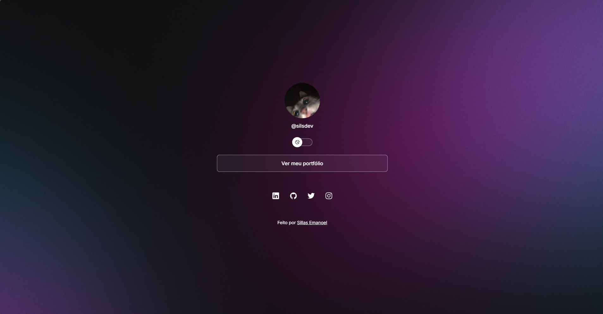

# DevLinks

DevLinks project created during studies.



## About

Project of a web page presenting personalized social links, with light/dark theme and responsive layout.

## Technologies

- HTML
- CSS
- JavaScript

## How to run

```bash
# Clone this repository
git clone https://github.com/sillasemanoel/study-devlinks.git

# Enter the project folder
cd study-devlinks

# Open the index.html file in your browser
```

## Author

Sillas Emanoel
